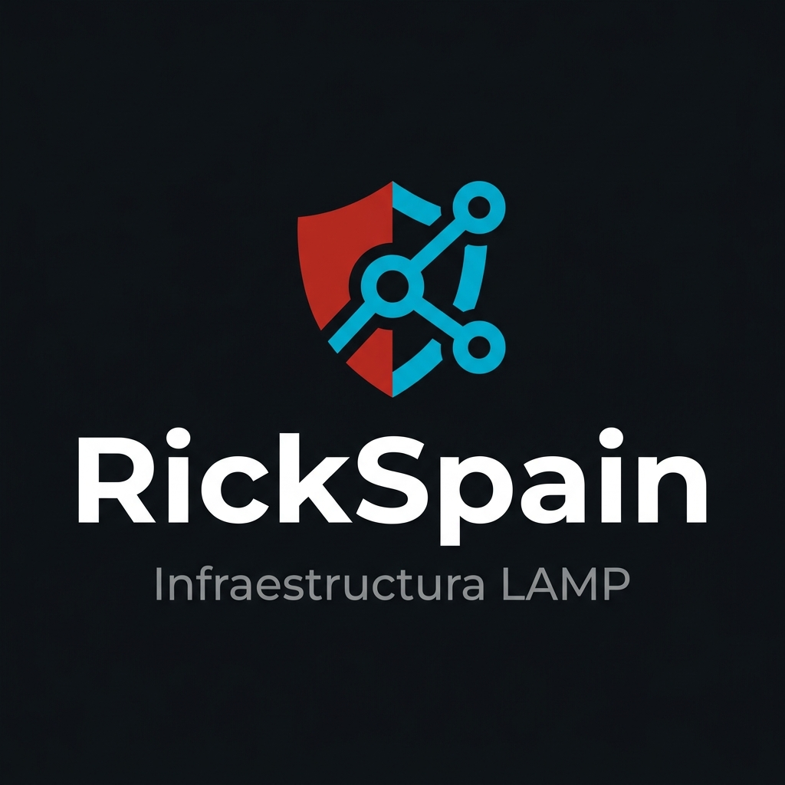
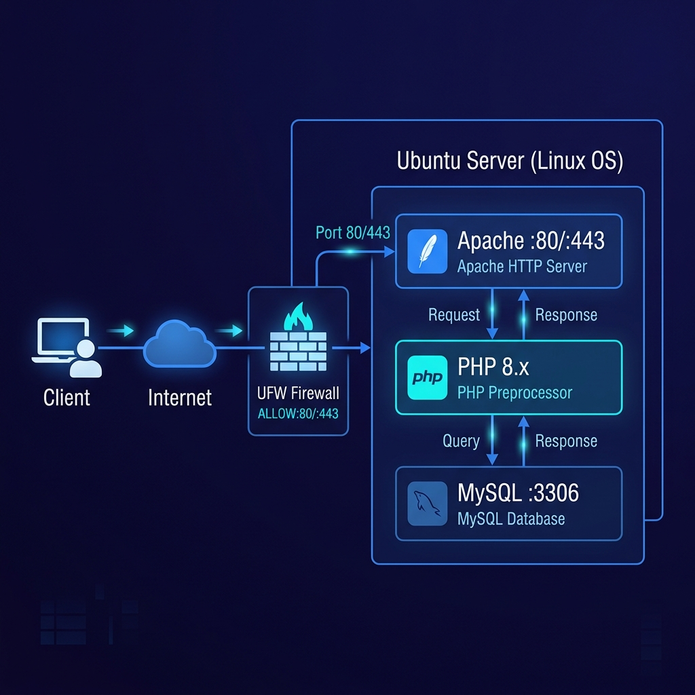
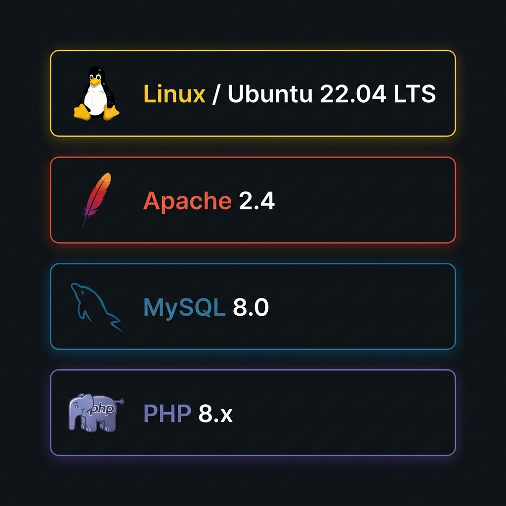

# RickSpain - Projecte d'Infraestructura LAMP

  

## Equip
!!! info
    | Nom | Rol |
    |-----|-----|
    | Joan Talens España | Product Owner |
    | Sergio Sala Gomet | Scrum Master |
    | Jose Carbonell Bonete | SysAdmin |
    | Hugo Fernandez Garcia | SysAdmin |

## Objectiu
Desplegar un servidor LAMP segur i documentar-lo professionalment.

## SCRUM
!!! success
    - Trello amb backlog  
    - Rols definits  
    - Seguiment iteratiu  

## Arquitectura

## Stack tecnològic
| Component | Funció |
|----------|--------|
| Ubuntu Server | Sistema base |
| Apache | Servidor web |
| MySQL | Base de dades |
| PHP | Backend |

---

## Llicència
Creative Commons BY-SA

