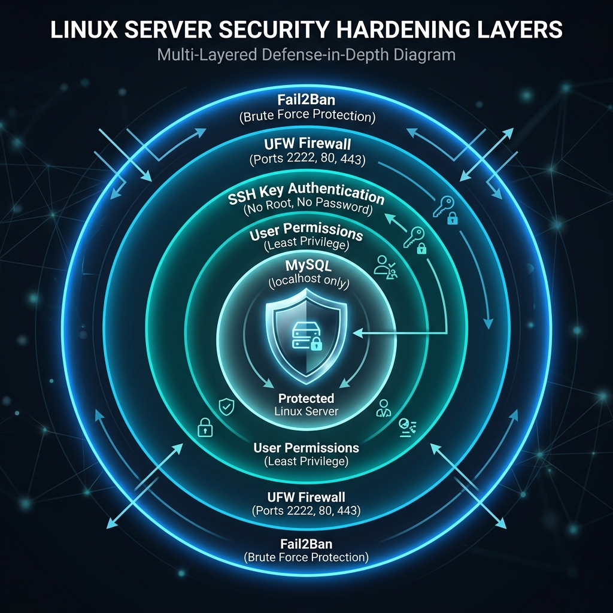

# Hardening del sistema



## SSH segur

```bash
sudo nano /etc/ssh/sshd_config
```

```
PermitRootLogin no
PasswordAuthentication no
Port 2222
```

```bash
sudo systemctl restart ssh
```

## Firewall
```bash
sudo ufw allow 2222
sudo ufw allow 80
sudo ufw enable
```

## Fail2Ban
```bash
sudo apt install fail2ban
sudo systemctl enable fail2ban
```

!!! success
    Sistema protegit contra atacs de força bruta

---

## SSL / HTTPS amb Let's Encrypt

Instal·la Certbot per obtenir un certificat SSL gratuït:

```bash
sudo apt install certbot python3-certbot-apache -y
sudo certbot --apache -d rickspain.local
```

Renovació automàtica del certificat (Certbot ho configura sol, però pots verificar-ho):

```bash
sudo certbot renew --dry-run
```

Afegeix redirecció HTTP → HTTPS al VirtualHost:

```apache
<VirtualHost *:80>
    ServerName rickspain.local
    Redirect permanent / https://rickspain.local/
</VirtualHost>
```

!!! info
    Let's Encrypt requereix un domini públic. Per a entorns de laboratori utilitza un certificat autosignat.

---

## Permisos de fitxers

Comprova que cap fitxer sensible sigui llegible per tots:

```bash
sudo find /etc -name "*.conf" -perm /o+w 2>/dev/null
sudo chmod 640 /etc/mysql/mysql.conf.d/mysqld.cnf
```

Permisos recomanats:

| Fitxer | Permisos |
|--------|----------|
| `/etc/ssh/sshd_config` | `600` |
| `/var/www/html` (dirs) | `755` |
| `/var/www/html` (fitxers) | `644` |
| Fitxers de configuració BD | `640` |

---

## Actualitzacions automàtiques de seguretat

```bash
sudo apt install unattended-upgrades -y
sudo dpkg-reconfigure --priority=low unattended-upgrades
```

Verifica la configuració:

```bash
cat /etc/apt/apt.conf.d/20auto-upgrades
```

---

## Auditoria de logs

Consulta intents de login fallits:

```bash
sudo grep "Failed password" /var/log/auth.log | tail -20
```

Consulta accions sudo:

```bash
sudo grep "sudo" /var/log/auth.log | tail -20
```

Consulta accessos Apache:

```bash
sudo tail -50 /var/log/apache2/access.log
sudo tail -50 /var/log/apache2/error.log
```

!!! tip
    Considera instal·lar `logwatch` o `auditd` per a monitoratge centralitzat de logs.
